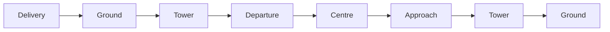

# ATC Communications

Call-and-response scripts for a normal VATSIM IFR flight, in the order you will
need them. Fill in the [worksheet](#flight-worksheet) before pushback and the
`{TOKENS}` below become real sentences.

## Station Handoff Chain

| # | Station | You are | Section |
| --- | --- | --- | --- |
| 1 | Delivery | at the stand | [Clearance Delivery](#1--clearance-delivery-startup) |
| 2 | Ground | pushing back, taxiing out | [Ground](#2--ground-pushback-and-taxi) |
| 3 | Tower | lining up, departing | [Tower](#3--tower-departure) |
| 4 | Departure → Centre | climbing, cruising | [Departure and Centre](#4--departure-and-centre-climb-and-cruise) |
| 5 | Approach | descending, being vectored | [Approach](#5--approach) |
| 6 | Tower | landing | [Tower](#6--tower-landing) |
| 7 | Ground | taxiing to stand | [Ground](#7--ground-taxi-to-stand) |

## Flight Worksheet

Fill this in from SimBrief and the ATIS before you call Delivery.

| Token | Meaning | This flight |
| --- | --- | --- |
| `{CALLSIGN}` | your callsign | |
| `{DEP}` | departure airport | |
| `{ARR}` | destination airport | |
| `{STAND}` | gate or stand | |
| `{ATIS}` | ATIS information letter | |
| `{RWY}` | active runway | |
| `{SID}` | departure route | |
| `{STAR}` | standard terminal arrival route | |
| `{SQUAWK}` | transponder code | |
| `{APPROACH}` | type of approach | |
| `{FREQ}` | frequency of the next station | |

Filled in as you go: `{ALT}` current altitude · `{FL}` assigned flight level ·
`{HDG}` heading · `{SPD}` speed · `{QNH}` altimeter setting · `{VOR}` fix or
navaid · `{WIND}` wind · `{TAXI ROUTE}` taxiways · `{HOLDING POINT}` holding
point.

---

## 1 · Clearance Delivery (Startup)

### Request en-route clearance

**You**
> {DEP} Delivery, good day, {CALLSIGN} at stand {STAND} with information
> {ATIS}, requesting clearance to {ARR}.

**ATC**
> {CALLSIGN}, {DEP} Delivery, good day, clearance is to {ARR}, {SID} departure,
> runway {RWY}, squawk {SQUAWK}.

**You** — readback
> Cleared to {ARR}, {SID} departure, runway {RWY}, squawk {SQUAWK}, {CALLSIGN}.

**ATC**
> {CALLSIGN}, readback is correct, report ready for startup.

**You**
> Wilco, {CALLSIGN}.

### Request startup

**You**
> {CALLSIGN} is ready for startup.

**ATC**
> {CALLSIGN}, roger, startup is approved, for the pushback contact Ground on
> {FREQ}.

**You** — readback
> Startup approved and Ground on {FREQ} for the pushback, {CALLSIGN}, bye bye.

## 2 · Ground (Pushback and Taxi)

### Request pushback

**You**
> {DEP} Ground, good day, {CALLSIGN} at stand {STAND}, requesting pushback.

**ATC**
> {CALLSIGN}, {DEP} Ground, good day, pushback is approved.

**You** — readback
> Pushback approved, {CALLSIGN}.

### Request taxi

**You**
> {CALLSIGN}, request taxi.

**ATC**
> {CALLSIGN}, taxi to {HOLDING POINT}, via {TAXI ROUTE}.

**You** — readback
> Taxi to {HOLDING POINT}, via {TAXI ROUTE}, {CALLSIGN}.

### Give way

**ATC**
> {CALLSIGN}, give way to the {AIRLINE AND TYPE} from the right.

**You** — readback
> Give way to the {AIRLINE AND TYPE} from the right, {CALLSIGN}.

### Handoff to Tower

**ATC**
> {CALLSIGN}, at {HOLDING POINT} hold short and contact Tower on {FREQ}, bye bye.

**You** — readback
> At {HOLDING POINT} hold short and contact Tower on {FREQ}, {CALLSIGN}.

## 3 · Tower (Departure)

### Report ready for departure

**You**
> {DEP} Tower, good day, {CALLSIGN} at {HOLDING POINT}, ready for departure.

**ATC**
> {CALLSIGN}, {DEP} Tower, good day, line up and wait runway {RWY}.

**You** — readback
> Line up and wait runway {RWY}, {CALLSIGN}.

### Takeoff clearance

**ATC**
> {CALLSIGN}, wind {WIND}, runway {RWY}, cleared for takeoff.

**You** — readback
> Cleared for takeoff runway {RWY}, {CALLSIGN}.

### Handoff to Departure

**ATC**
> {CALLSIGN}, contact {DEP} Departure on {FREQ}, bye bye.

**You** — readback
> Contact {DEP} Departure on {FREQ}, {CALLSIGN}, bye bye.

## 4 · Departure and Centre (Climb and Cruise)

### Check in with Departure

**You**
> {DEP} Departure, good day, {CALLSIGN}, passing {ALT}, {SID}.

**ATC**
> {CALLSIGN}, {DEP} Departure, identified, climb {FL}.

**You** — readback
> Climb {FL}, {CALLSIGN}.

### Direct routing

**ATC**
> {CALLSIGN}, direct to {VOR}.

**You** — readback
> Direct {VOR}, {CALLSIGN}.

### Handoff to Centre

**ATC**
> {CALLSIGN}, contact {STATION} on {FREQ}, bye bye.

**You** — readback
> Contact {STATION} on {FREQ}, {CALLSIGN}, bye bye.

### Check in with Centre

**You**
> {STATION}, good day, {CALLSIGN}, passing {ALT}, inbound to {VOR}.

**ATC**
> {CALLSIGN}, good day, {STATION}, identified, climb {FL}.

**You** — readback
> Climb {FL}, {CALLSIGN}.

### Request descent

**You**
> {CALLSIGN}, request descent.

**ATC**
> {CALLSIGN}, descend to {FL}.

**You** — readback
> Descending to {FL}, {CALLSIGN}.

### Check in with the next Centre, and get an approach

**You**
> {STATION}, good day, {CALLSIGN}, passing {ALT} for {FL}, inbound to {VOR}.

**ATC**
> {CALLSIGN}, good day, radar contact, {STAR}, expect {APPROACH} runway {RWY},
> descend {FL}.

**You** — readback
> {STAR}, {APPROACH} runway {RWY} and descend {FL}, {CALLSIGN}.

### Handoff to Approach

**ATC**
> {CALLSIGN}, contact {ARR} Approach on {FREQ}, bye bye.

**You** — readback
> Contact {ARR} Approach on {FREQ}, {CALLSIGN}, bye bye.

## 5 · Approach

### Check in

**You**
> {ARR} Approach, good day, {CALLSIGN}, {FL}, {STAR}.

**ATC**
> {CALLSIGN}, {ARR} Approach, good day, continue approach.

**You** — readback
> Continue approach, {CALLSIGN}.

### Vectors

Any of these, in any order:

**ATC**
> {CALLSIGN}, descend {FL} and after {VOR} fly heading {HDG}.

**You** — readback
> Descend {FL} and after {VOR} fly heading {HDG}, {CALLSIGN}.

**ATC**
> {CALLSIGN}, fly heading {HDG}, descend {FL}, QNH {QNH}.

**You** — readback
> Fly heading {HDG}, descend {FL} on QNH {QNH}, {CALLSIGN}.

**ATC**
> {CALLSIGN}, turn left heading {HDG}, speed {SPD}.

**You** — readback
> Left heading {HDG} and speed {SPD}, {CALLSIGN}.

### Approach clearance

**ATC**
> {CALLSIGN}, turn left heading {HDG}, cleared {APPROACH} runway {RWY}.

**You** — readback
> Turn left heading {HDG}, cleared {APPROACH} runway {RWY}, {CALLSIGN}.

### Handoff to Tower

**ATC**
> {CALLSIGN}, contact {ARR} Tower on {FREQ}, bye bye.

**You** — readback
> Contact {ARR} Tower on {FREQ}, {CALLSIGN}, bye bye.

## 6 · Tower (Landing)

### Check in

**You**
> {ARR} Tower, {CALLSIGN}, {APPROACH} runway {RWY}.

**ATC**
> {CALLSIGN}, good day.

> [!NOTE]
> Tower may add a number — that is your landing sequence, i.e. how many aircraft
> are ahead of you on the runway.

### Landing clearance

**ATC**
> {CALLSIGN}, wind {WIND}, runway {RWY} cleared to land.

**You** — readback
> Cleared to land runway {RWY}, {CALLSIGN}.

## 7 · Ground (Taxi to Stand)

**ATC**
> {CALLSIGN}, {ARR} Ground, taxi to stand {STAND} via {TAXI ROUTE}.

**You** — readback
> Taxi to stand {STAND} via {TAXI ROUTE}, {CALLSIGN}.

---

## Phonetic Alphabet

| Letter | Word | Letter | Word | Letter | Word |
| --- | --- | --- | --- | --- | --- |
| **A** | Alpha | **B** | Bravo | **C** | Charlie |
| **D** | Delta | **E** | Echo | **F** | Foxtrot |
| **G** | Golf | **H** | Hotel | **I** | India |
| **J** | Juliet | **K** | Kilo | **L** | Lima |
| **M** | Mike | **N** | November | **O** | Oscar |
| **P** | Papa | **Q** | Quebec | **R** | Romeo |
| **S** | Sierra | **T** | Tango | **U** | Uniform |
| **V** | Victor | **W** | Whiskey | **X** | Xray |
| **Y** | Yankee | **Z** | Zulu | | |

## Numbers

| Digit | Say | Digit | Say |
| --- | --- | --- | --- |
| 0 | ZE-RO | 5 | FIFE |
| 1 | WUN | 6 | SIX |
| 2 | TOO | 7 | SEV-EN |
| 3 | TREE | 8 | AIT |
| 4 | FOW-ER | 9 | NIN-ER |

Flight levels and headings are spoken digit by digit: FL310 is "flight level
tree wun zero", heading 270 is "heading too sev-en zero". Altitudes in feet keep
"thousand": 5,000 ft is "fife thousand".
